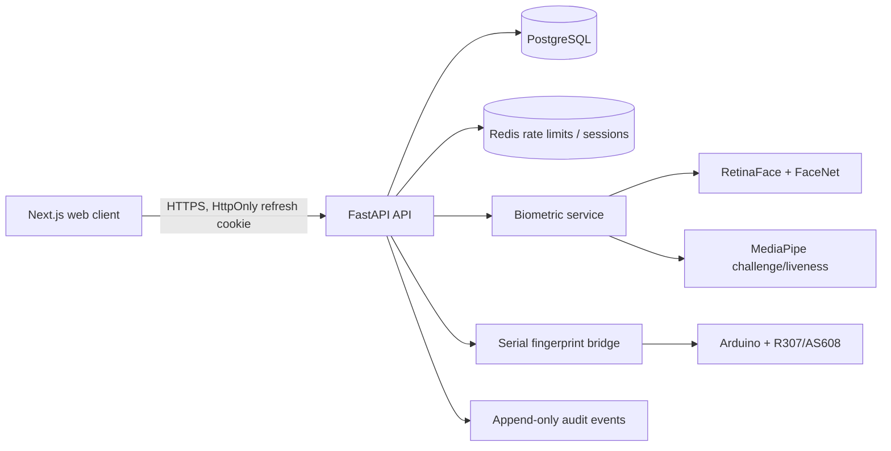
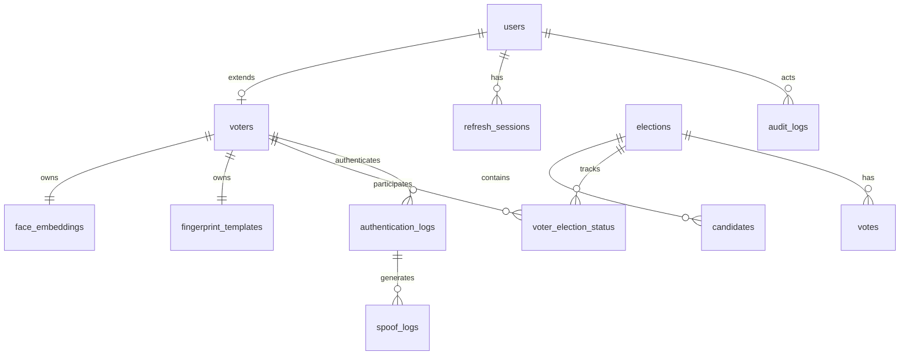

# Secure Digital Voting System — Architecture

## Security boundary

The system deliberately separates identity proofing from ballot storage. A successful biometric session creates a short-lived, election-scoped voting grant. Casting a ballot consumes the grant in the same database transaction that marks the voter as having voted. The vote table contains no voter identifier; the receipt is a random identifier and therefore cannot reveal a selection.

## Authentication state machine

`IDENTIFIED → FINGERPRINT_VERIFIED → FACE_VERIFIED → LIVENESS_VERIFIED → CHALLENGE_VERIFIED → RISK_ACCEPTED → GRANT_ISSUED → BALLOT_CAST`

Each transition is stored in `authentication_logs`; a failed transition terminally closes the session. Browser images are transmitted only in-memory in the request body and are never written to disk. Face templates and fingerprint templates are encrypted at rest with AES-GCM using a key supplied outside the database.

## Deployment topology

- **web**: Next.js server, reverse-proxied by Nginx.
- **api**: FastAPI/Uvicorn workers with no biometric source files persisted.
- **postgres**: primary transactional datastore; required in all non-test deployments.
- **redis**: rate limiting, refresh-session revocation, and ephemeral challenges.
- **fingerprint bridge**: USB-attached deployment only. The API accepts results only from a bridge authenticated by `HARDWARE_BRIDGE_TOKEN`.

## Core data model

`voter_election_status` is intentionally separate from `votes`. It is the only location that binds a voter to an election, while the anonymous `votes` table cannot be joined to that identity.

## API design

| Area | Prefix | Primary operations |
|---|---|---|
| Administration | `/api/v1/admin` | voters, candidates, elections, audit exports, analytics |
| Identity | `/api/v1/auth` | login, refresh, logout, session lifecycle |
| Biometric flow | `/api/v1/biometric` | start, fingerprint, face, challenge, risk evaluation |
| Ballot | `/api/v1/voting` | election list, candidates, cast anonymous vote |
| Hardware bridge | `/api/v1/hardware` | signed fingerprint probe result ingestion |

The running API publishes interactive OpenAPI documentation at `/docs` and a machine-readable contract at `/openapi.json`.

## Implementation roadmap

1. Create normalized database models, migrations, cryptographic protections, access roles, and audit trail.
2. Implement the fail-closed biometric orchestration and serial hardware bridge.
3. Build the browser client around the authenticated API—not mock data.
4. Containerize API, web, PostgreSQL, Redis, and Nginx; include Arduino firmware and operational docs.
5. Run API tests and static frontend checks. Hardware and calibrated model tests are executed with the actual sensor/model bundle during deployment.

## Operational prerequisites

- TLS termination with an organization-managed certificate.
- A 32-byte `BIOMETRIC_ENCRYPTION_KEY`, unique JWT keys, and a PostgreSQL database not exposed publicly.
- An enrolled R307/AS608 device connected to the fingerprint bridge host.
- Model assets licensed for deployment. The packaged service uses real MediaPipe landmark inference; RetinaFace/FaceNet inference is enabled by installing `deepface` and its model dependencies.
- This project supports controlled elections and research/hackathon deployments. Binding legal elections requires an independent security assessment, legal compliance review, accessibility review, and operational procedures.
