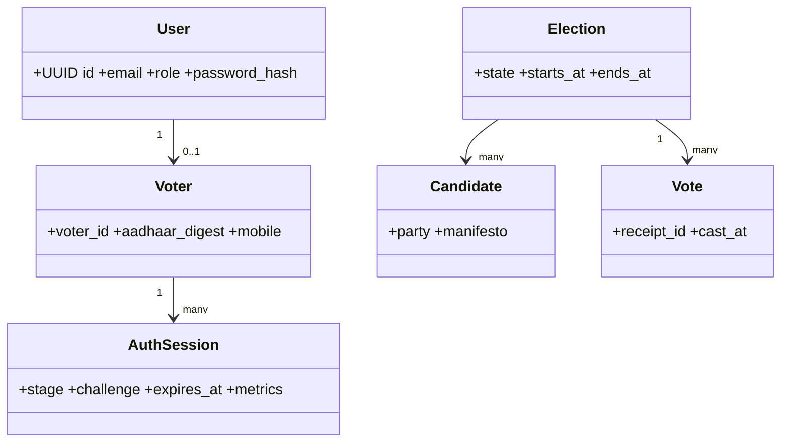
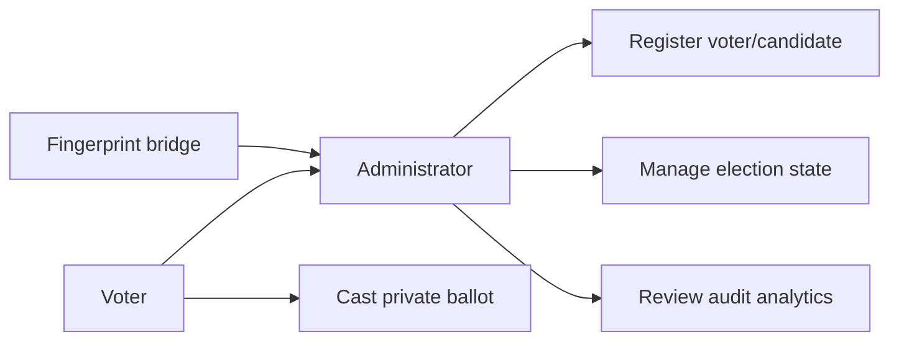
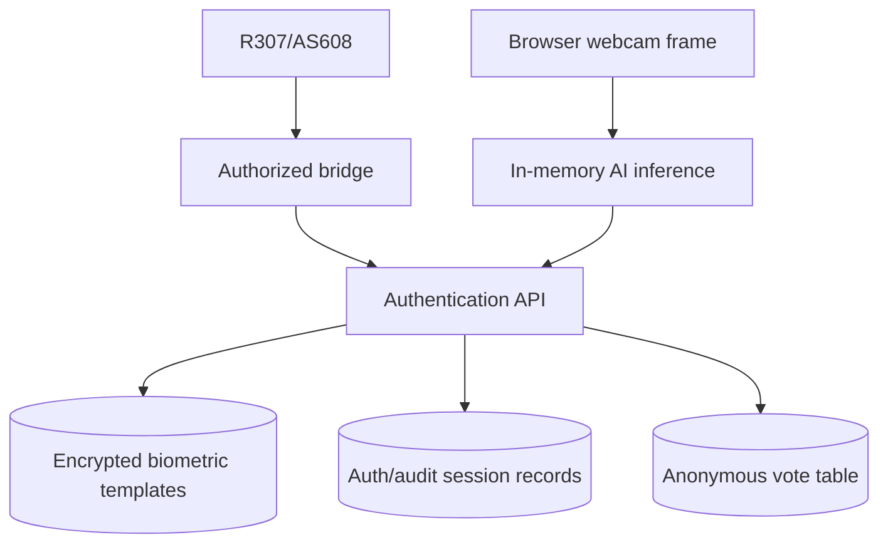

# System diagrams

## Class/data responsibilities



## Use cases



## Activity and sequence

```mermaid
sequenceDiagram
 participant V as Voter browser
 participant F as Sensor bridge
 participant A as API
 participant D as Database
 V->>A: Start(Voter ID, election)
 A->>D: Create timed auth session
 F->>A: Signed physical sensor result
 V->>A: Live camera frames
 A->>A: FaceNet, liveness, challenge, risk
 A->>V: Single-use voting grant
 V->>A: Candidate + grant
 A->>D: Lock voter status; write anonymous vote; consume grant
 A->>V: Receipt ID
```

## Data-flow diagram


